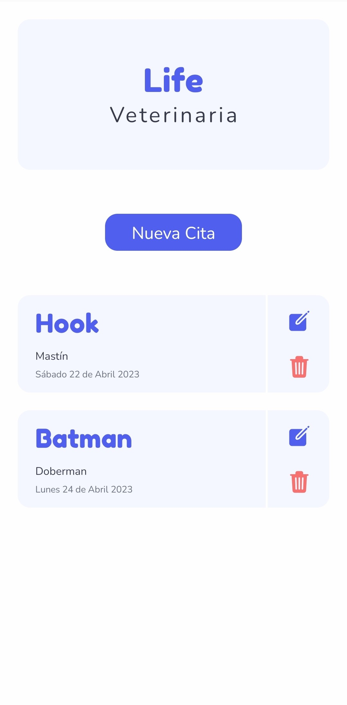
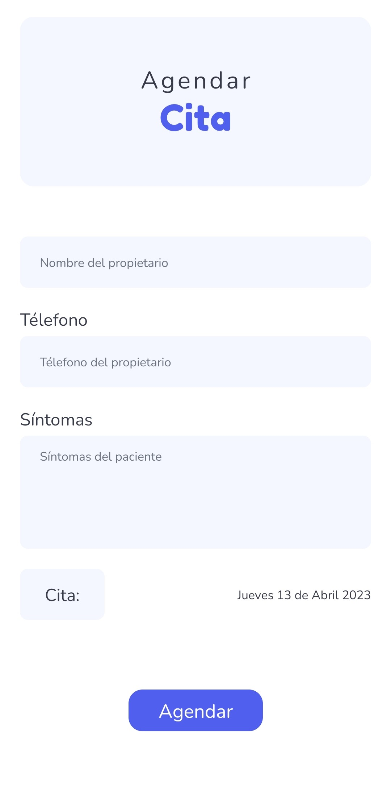
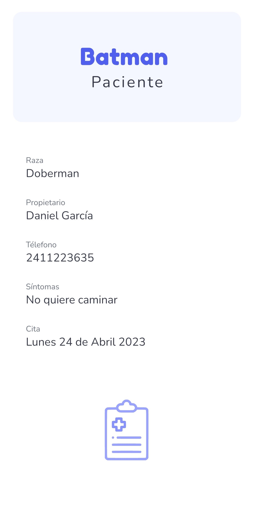

# Citas Veterinaria

## App creada en React Native con Expo

<table>
  <tr>
    <td></td>
    <td></td>
    <td></td>
  </tr>
</table>

## Se utiliza AsyncStorage para almacenar la información

## Desarrollo

```
yarn run start
```
